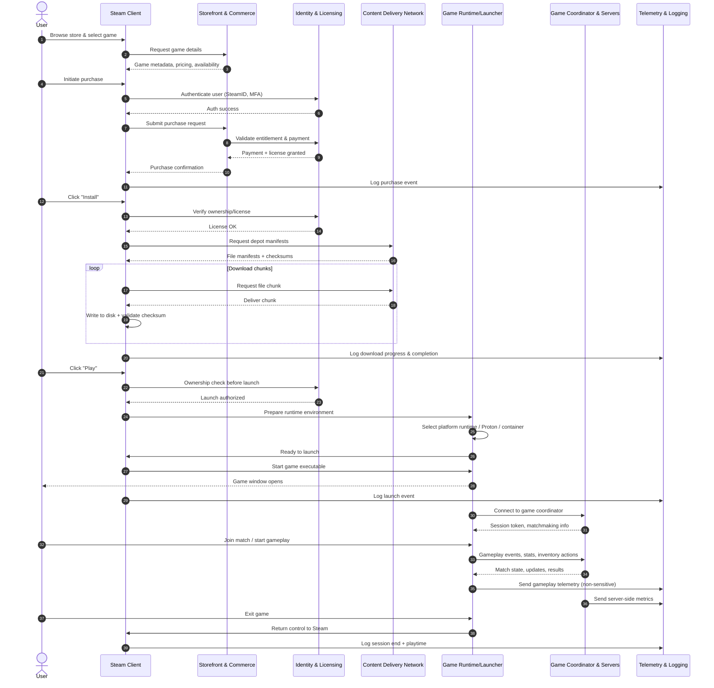

```mermaid
sequenceDiagram
    autonumber
    actor User
    participant Client as Steam Client
    participant Store as Storefront & Commerce
    participant Auth as Identity & Licensing
    participant CDN as Content Delivery Network
    participant Runtime as Game Runtime/Launcher
    participant Game as Game Coordinator & Servers
    participant Telemetry as Telemetry & Logging

    %% ============================
    %% PURCHASE FLOW
    %% ============================
    User->>Client: Browse store & select game
    Client->>Store: Request game details
    Store-->>Client: Game metadata, pricing, availability

    User->>Client: Initiate purchase
    Client->>Auth: Authenticate user (SteamID, MFA)
    Auth-->>Client: Auth success

    Client->>Store: Submit purchase request
    Store->>Auth: Validate entitlement & payment
    Auth-->>Store: Payment + license granted
    Store-->>Client: Purchase confirmation

    Client->>Telemetry: Log purchase event

    %% ============================
    %% DOWNLOAD FLOW
    %% ============================
    User->>Client: Click "Install"
    Client->>Auth: Verify ownership/license
    Auth-->>Client: License OK

    Client->>CDN: Request depot manifests
    CDN-->>Client: File manifests + checksums

    loop Download chunks
        Client->>CDN: Request file chunk
        CDN-->>Client: Deliver chunk
        Client->>Client: Write to disk + validate checksum
    end

    Client->>Telemetry: Log download progress & completion

    %% ============================
    %% LAUNCH FLOW
    %% ============================
    User->>Client: Click "Play"
    Client->>Auth: Ownership check before launch
    Auth-->>Client: Launch authorized

    Client->>Runtime: Prepare runtime environment
    Runtime->>Runtime: Select platform runtime / Proton / container
    Runtime->>Client: Ready to launch

    Client->>Runtime: Start game executable
    Runtime-->>User: Game window opens

    Client->>Telemetry: Log launch event

    %% ============================
    %% GAMEPLAY FLOW
    %% ============================
    Runtime->>Game: Connect to game coordinator
    Game-->>Runtime: Session token, matchmaking info

    User->>Runtime: Join match / start gameplay
    Runtime->>Game: Gameplay events, stats, inventory actions
    Game-->>Runtime: Match state, updates, results

    Runtime->>Telemetry: Send gameplay telemetry (non-sensitive)
    Game->>Telemetry: Send server-side metrics

    %% ============================
    %% SESSION END
    %% ============================
    User->>Runtime: Exit game
    Runtime->>Client: Return control to Steam
    Client->>Telemetry: Log session end + playtime
```