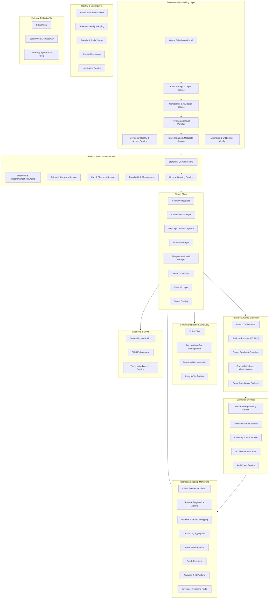

```mermaid
flowchart TD

%% ============================
%% Developer & Publishing Layer
%% ============================
subgraph DEV[Developer & Publishing Layer]
    A1[Developer Identity & Access Service]
    A2[Game Submission Portal]
    A3[Build Storage & Depot Service]
    A4[Compliance & Validation Service]
    A5[Review & Approval Workflow]
    A6[Store Catalog & Metadata Service]
    A7[Licensing & Entitlement Config]
end

%% ============================
%% Storefront & Commerce Layer
%% ============================
subgraph STORE[Storefront & Commerce Layer]
    B1[Storefront UI &lpar;Web/Client&rpar;]
    B2[Discovery & Recommendation Engine]
    B3[Pricing & Currency Service]
    B4[Cart & Checkout Service]
    B5[Fraud & Risk Management]
    B6[License Granting Service]
end

%% ============================
%% Identity & Social Layer
%% ============================
subgraph ID[Identity & Social Layer]
    C1[Account & Authentication]
    C2[SteamID Identity Mapping]
    C3[Friends & Social Graph]
    C4[Chat & Messaging]
    C5[Notification Service]
end

%% ============================
%% Content Distribution Layer
%% ============================
subgraph CDN[Content Distribution & Delivery]
    D1[Global CDN]
    D2[Depot & Manifest Management]
    D3[Download Orchestration]
    D4[Integrity Verification]
end

%% ============================
%% Steam Client Layer
%% ============================
subgraph CLIENT[Steam Client]
    E1[Client Orchestrator]
    E2[Connection Manager]
    E3[Message Dispatch System]
    E4[Library Manager]
    E5[Filesystem & Install Manager]
    E6[Steam Cloud Sync]
    E7[Client UI Layer]
    E8[Steam Overlay]
end


%% ============================
%% Runtime & Execution Layer
%% ============================
subgraph RUNTIME[Runtime & Game Execution]
    F1[Launch Orchestrator]
    F2[Platform Runtime &lpar;OS APIs&rpar;]
    F3[Steam Runtime / Container]
    F4[Compatibility Layer &lpar;Proton/Wine&rpar;]
    F5[Game Coordinator Backend]
end

%% ============================
%% Gameplay Services Layer
%% ============================
subgraph GAME[Gameplay Services]
    G1[Matchmaking & Lobby Service]
    G2[Dedicated Game Servers]
    G3[Inventory & Item Service]
    G4[Achievements & Stats]
    G5[Anti-Cheat Service]
end

%% ============================
%% Licensing & DRM Layer
%% ============================
subgraph DRM[Licensing & DRM]
    H1[Ownership Verification]
    H2[DRM Enforcement]
    H3[Time-Limited Access Service]
end

%% ============================
%% Telemetry & Monitoring Layer
%% ============================
subgraph TELEMETRY[Telemetry, Logging, Monitoring]
    I1[Client Telemetry Collector]
    I2[Runtime Diagnostics Logging]
    I3[Network & Protocol Logging]
    I4[Central Log Aggregation]
    I5[Monitoring & Alerting]
    I6[Crash Reporting]
    I7[Analytics & BI Platform]
    I8[Developer Reporting Portal]
end

%% ============================
%% External Tools & APIs
%% ============================
subgraph EXT[External Tools & APIs]
    J1[SteamCMD]
    J2[Steam Web API Gateway]
    J3[Third-Party Sync/Backup Tools]
end

%% ============================
%% Connections &lpar;High-Level Flow&rpar;
%% ============================
A2 --> A3 --> A4 --> A5 --> A6 --> STORE
STORE --> B6 --> CLIENT
CLIENT --> CDN
CLIENT --> RUNTIME
RUNTIME --> GAME
CLIENT --> DRM
CLIENT --> TELEMETRY
GAME --> TELEMETRY

```