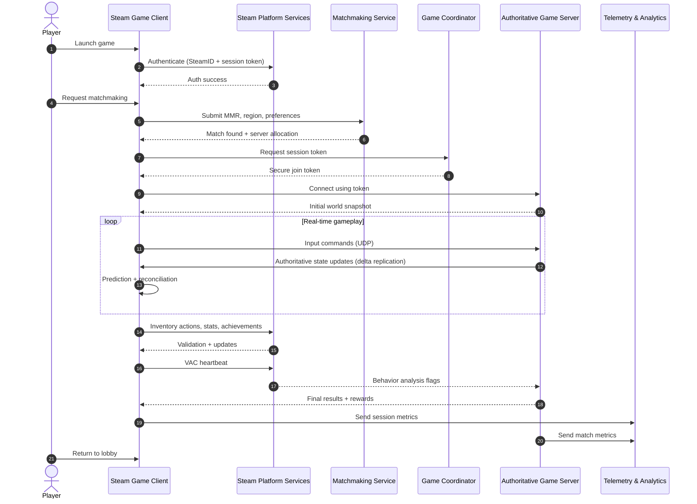

```mermaid
sequenceDiagram
    autonumber
    actor Player
    participant Client as Steam Game Client
    participant Steam as Steam Platform Services
    participant MM as Matchmaking Service
    participant GC as Game Coordinator
    participant Server as Authoritative Game Server
    participant Telemetry as Telemetry & Analytics

    %% --- Client Launch ---
    Player->>Client: Launch game
    Client->>Steam: Authenticate (SteamID + session token)
    Steam-->>Client: Auth success

    %% --- Matchmaking ---
    Player->>Client: Request matchmaking
    Client->>MM: Submit MMR, region, preferences
    MM-->>Client: Match found + server allocation

    %% --- Session Setup ---
    Client->>GC: Request session token
    GC-->>Client: Secure join token

    Client->>Server: Connect using token
    Server-->>Client: Initial world snapshot

    %% --- Gameplay Sync ---
    loop Real-time gameplay
        Client->>Server: Input commands (UDP)
        Server->>Client: Authoritative state updates (delta replication)
        Client->>Client: Prediction + reconciliation
    end

    %% --- Inventory / Stats ---
    Client->>Steam: Inventory actions, stats, achievements
    Steam-->>Client: Validation + updates

    %% --- Anti-Cheat ---
    Client->>Steam: VAC heartbeat
    Steam-->>Server: Behavior analysis flags

    %% --- Match End ---
    Server-->>Client: Final results + rewards
    Client->>Telemetry: Send session metrics
    Server->>Telemetry: Send match metrics

    Player->>Client: Return to lobby
```