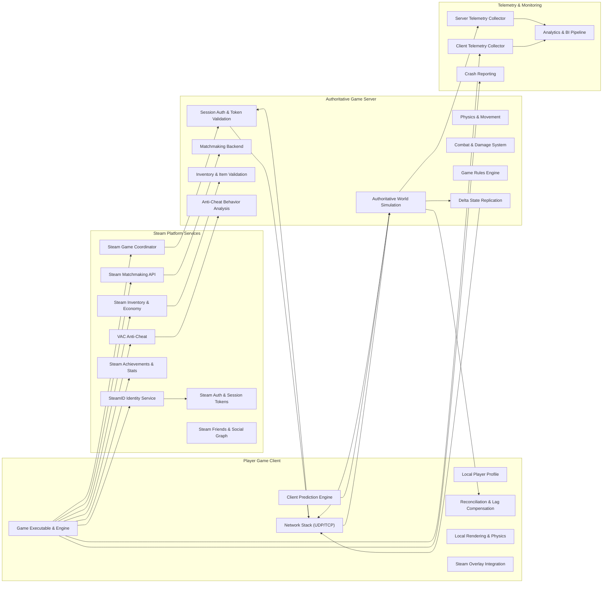

```mermaid
flowchart LR

%% ============================
%% Steam Multiplayer Architecture &lpar;High-Level&rpar;
%% ============================

%% -------- Platform Layer --------
subgraph PLATFORM[Steam Platform Services]
    P1[SteamID Identity Service]
    P2[Steam Auth & Session Tokens]
    P3[Steam Friends & Social Graph]
    P4[Steam Matchmaking API]
    P5[Steam Game Coordinator]
    P6[Steam Inventory & Economy]
    P7[Steam Achievements & Stats]
    P8[VAC Anti-Cheat]
end

%% -------- Client Layer --------
subgraph CLIENT[Player Game Client]
    C1[Game Executable & Engine]
    C2[Local Player Profile]
    C3[Network Stack &lpar;UDP/TCP&rpar;]
    C4[Client Prediction Engine]
    C5[Reconciliation & Lag Compensation]
    C6[Local Rendering & Physics]
    C7[Steam Overlay Integration]
end

%% -------- Server Layer --------
subgraph SERVER[Authoritative Game Server]
    S1[Session Auth & Token Validation]
    S2[Authoritative World Simulation]
    S3[Physics & Movement]
    S4[Combat & Damage System]
    S5[Game Rules Engine]
    S6[Matchmaking Backend]
    S7[Inventory & Item Validation]
    S8[Anti-Cheat Behavior Analysis]
    S9[Delta State Replication]
end

%% -------- Telemetry Layer --------
subgraph TELEMETRY[Telemetry & Monitoring]
    T1[Client Telemetry Collector]
    T2[Server Telemetry Collector]
    T3[Crash Reporting]
    T4[Analytics & BI Pipeline]
end

%% ============================
%% Connections
%% ============================

%% Client Launch
C1 --> P1
P1 --> P2

%% Matchmaking
C1 --> P4
P4 --> S6

%% Session Setup
C1 --> P5
P5 --> S1

%% Game Join
C3 --> S1
S1 --> C3

%% Real-Time Gameplay
C3 --> S2
S2 --> C3

C4 --> S2
S2 --> C5

S2 --> S9
S9 --> C3

%% Inventory & Economy
C1 --> P6
P6 --> S7

%% Achievements & Stats
C1 --> P7

%% Anti-Cheat
C1 --> P8
P8 --> S8

%% Telemetry
C1 --> T1
S2 --> T2
C1 --> T3
T1 --> T4
T2 --> T4
```