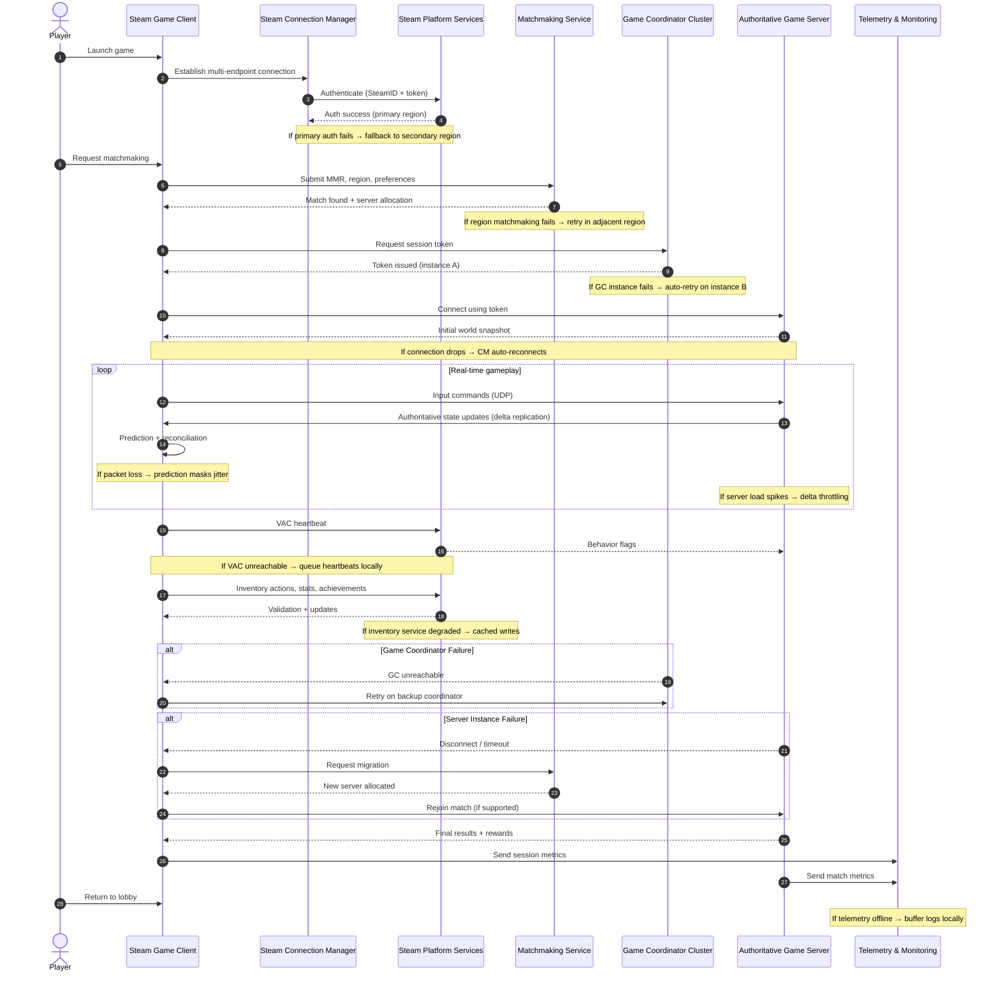

```mermaid
sequenceDiagram
    autonumber
    actor Player
    participant Client as Steam Game Client
    participant CM as Steam Connection Manager
    participant Steam as Steam Platform Services
    participant MM as Matchmaking Service
    participant GC as Game Coordinator Cluster
    participant Server as Authoritative Game Server
    participant Telemetry as Telemetry & Monitoring

    %% --- Client Launch & Resilient Auth ---
    Player->>Client: Launch game
    Client->>CM: Establish multi-endpoint connection
    CM->>Steam: Authenticate (SteamID + token)
    Steam-->>CM: Auth success (primary region)

    Note over CM,Steam: If primary auth fails → fallback to secondary region

    %% --- Matchmaking with Fallback ---
    Player->>Client: Request matchmaking
    Client->>MM: Submit MMR, region, preferences
    MM-->>Client: Match found + server allocation

    Note over MM: If region matchmaking fails → retry in adjacent region

    %% --- Session Token Resiliency ---
    Client->>GC: Request session token
    GC-->>Client: Token issued (instance A)

    Note over GC: If GC instance fails → auto‑retry on instance B

    %% --- Server Join with Reconnect Logic ---
    Client->>Server: Connect using token
    Server-->>Client: Initial world snapshot

    Note over Client,Server: If connection drops → CM auto‑reconnects

    %% --- Gameplay Sync with Resiliency ---
    loop Real-time gameplay
        Client->>Server: Input commands (UDP)
        Server->>Client: Authoritative state updates (delta replication)
        Client->>Client: Prediction + reconciliation

        Note over Client: If packet loss → prediction masks jitter
        Note over Server: If server load spikes → delta throttling
    end

    %% --- Anti-Cheat Resiliency ---
    Client->>Steam: VAC heartbeat
    Steam-->>Server: Behavior flags

    Note over Client,Steam: If VAC unreachable → queue heartbeats locally

    %% --- Inventory / Stats Resiliency ---
    Client->>Steam: Inventory actions, stats, achievements
    Steam-->>Client: Validation + updates

    Note over Steam: If inventory service degraded → cached writes

    %% --- Mid-Match Fault Handling ---
    alt Game Coordinator Failure
        GC-->>Client: GC unreachable
        Client->>GC: Retry on backup coordinator
    end

    alt Server Instance Failure
        Server-->>Client: Disconnect / timeout
        Client->>MM: Request migration
        MM-->>Client: New server allocated
        Client->>Server: Rejoin match (if supported)
    end

    %% --- Match End ---
    Server-->>Client: Final results + rewards
    Client->>Telemetry: Send session metrics
    Server->>Telemetry: Send match metrics

    Player->>Client: Return to lobby

    Note over Telemetry: If telemetry offline → buffer logs locally
```